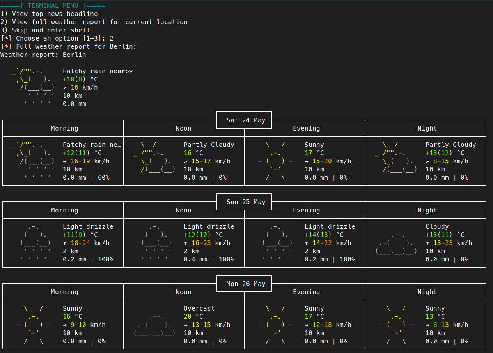
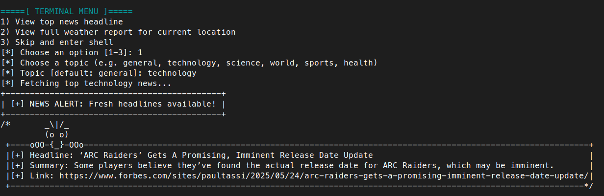

# Terminal Setup by fbarquez

[](LICENSE)
[](#)
[](#)

---

## Table of Contents

- [Features](#features)
- [Preview](#preview)
- [Project Structure](#project-structure)
- [How to Use](#how-to-use)
- [What's Inside install.sh](#whats-inside-installsh)
- [Customization](#customization)
- [Tested On](#tested-on)
- [Contributing](#contributing)
- [License](#license)
- [Author](#author)

---

A customizable and interactive Zsh terminal dashboard that helps you stay focused, boost productivity, and start each session with useful, meaningful context.

This script sets up your Zsh shell with a sleek Powerlevel10k theme, live weather, motivational quotes, real-time news headlines, and more, all displayed automatically at startup

---

## Features

- Detects your **exact physical location** to show accurate local weather 
- Displays a daily **motivational quote** from ZenQuotes 
- Fetches latest **news headlines** via [GNews API](https://gnews.io/)
- Includes a **terminal dashboard layout** using `boxes` 
- Detects **SSH sessions** and logs IP/date 
-  Tracks sessions in `.terminal_log` (optional) 
- Fully **portable** via `install.sh`


---

## Preview

```shell
[*] USER: fbarquez      DATE: Fri 24 May 2025 – 10:25
[*] HOST: my-laptop

        =====[ LOCAL WEATHER ]=====
[✓] Local weather in Berlin :: 🌤 +18°C

=====[ DAILY DOSE ]=====
Start where you are. Use what you have. Do what you can. 
---

## Project Structure

```bash
my-terminal-setup/
├── .zshrc              # Main shell config (loads theme + dashboard logic)
├── .p10k.zsh           # Powerlevel10k theme configuration
├── .terminal_log       # (Optional) Keeps logs of each session with timestamp
├── install.sh          # Installation script to replicate on new machines
└── README.md           # This file 
```

---

## How to Use

### 1. Prerequisites

* A Debian/Ubuntu-based system
* Basic knowledge of terminal usage
* An internet connection (to pull weather/news quotes)
* Optional: GitHub API key for news (free): [Get it from GNews.io](https://gnews.io/)

---

### 2. Installation

Clone this repo and run the script:

```bash
git clone git@github.com:fbarquez/terminal-setup.git
cd terminal-setup
chmod +x install.sh
./install.sh
```

If you're on a system where you **already have configs you don't want to overwrite**, do **not** run the script. Instead, inspect each file manually:

```bash
cat .zshrc
cat install.sh
```

---

### 3. What's Inside the `install.sh`?

This script performs the following steps:

1. Installs dependencies (`zsh`, `jq`, `curl`, `boxes`, and `fonts-powerline`)
2. Copies `.zshrc`, `.p10k.zsh`, and optionally `.terminal_log` to your `$HOME`
3. Sets `zsh` as the default shell (if not already)
4. Clones `powerlevel10k` if missing
5. Shows you a reminder to restart the shell

All steps are **non-destructive**, unless you **already have `.zshrc` or `.p10k.zsh`**, in which case they will be overwritten. You can add a `backup` line in the script if you prefer safety.

---

## Logging

* All terminal sessions are logged to `.terminal_log` by default.
* SSH sessions are detected, and the connecting IP + time is shown at login.

---

## Motivational Quotes

* Pulled from [zenquotes.io](https://zenquotes.io/api/random)
* Fallback to a static quote if offline or API fails

---

## Weather Forecast

* Uses [wttr.in](https://wttr.in) and your IP to detect the **actual physical location** of your machine.
* It displays a brief forecast and temperature.

---

## News Headlines (optional)

* Uses [GNews.io API](https://gnews.io/)
* Free API key required, with a daily request limit
* Edit your `.zshrc` to insert your key as an environment variable:

```bash
export GNEWS_API_KEY="your_api_key_here"
```

---

## Customization

Want to show a custom city, more quotes, or different styles?

Edit `.zshrc` and tweak:

* `curl wttr.in/...` to change city format
* `quote=$(curl ...)` to use a different quotes API
* Change `boxes -d style` to switch visual layout

---

## Manual Restore (Optional)

If you need to re-run the startup dashboard manually:

```bash
source ~/.zshrc
```

---

## Tested On

* Ubuntu 22.04+
* Debian 12+
* Zsh 5.8+
* Terminal emulators: GNOME Terminal, Alacritty, Tilix

---

## Screenshots

### Full Weather Forecast
Get multi-day forecast with morning, noon, evening, and night reports — all based on your actual location.



---

### News Headlines by Topic
Choose your favorite category and get the top news headline on each terminal startup.



---

## Contributing

If you want to improve this script or suggest a new feature, feel free to fork this repo or open an issue.

---

## License

Feel free to fork this project, submit pull requests or suggest improvements via issues.

If you’d like to add features (like new weather APIs, themes, or dashboard styles), open a discussion first. Let’s make it better together!

---

## Author

Made with by **[@fbarquez](https://github.com/fbarquez)**

> “The terminal is not just a tool — it’s your command center.”

---
